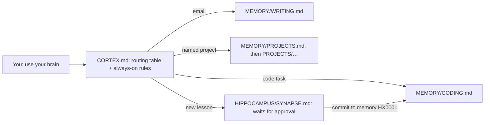

---
tags:
  - memory/core
---
# claude-brain

A second brain for AI harnesses: an Obsidian vault of short Markdown instructions that Claude (or any MCP client) reads before it works. It adds guardrails, cuts filler and wasted tokens, and reduces re-prompting.

## How it works



- **CORTEX.md** is the entry point: a routing table, the always-on rules (led by 7 non-negotiable token-economy rules) and the rules for updating the brain. It loads once per session.
- **MEMORY/** has one instruction file per area. The AI opens only the file the task needs, so a typical task loads about 1,500–2,500 tokens of instructions.
- **PROJECTS/** holds per-project context: goal, status, a short `## Now`, decisions, next actions.
- **HIPPOCAMPUS/** is where new information waits before it becomes memory: SYNAPSE.md holds numbered proposals (HX0001, HX0002…), and ENGRAM.md keeps the trail of what was committed or rejected.

Every area file has the same shape: tags, a scope line, Core Rules, Defaults, Avoid and Output. Corrections don't pile up as add-ons: committing one rewrites the rule it changes, so no two rules compete at read time.

Areas: CODING, THINKING, WRITING, RESEARCH, PLANNING, REVIEW, KNOWLEDGE, LANGUAGE, ANALYTICS, VISUAL, ASSISTANT, AUTOPILOT, SECURITY, BUSINESS, LEARNING, PROMPTING, MECHANICS, plus the PROJECTS index. The routing table in [CORTEX.md](CORTEX.md) says when each one loads.

## Token economy

The first block of CORTEX's always-on rules is non-negotiable: area files can't relax it, only you can.

- Answer first with only what the query requires: no fluff or pleasantries, one sentence when it suffices, short paragraphs and bullets.
- No code unless explicitly asked; when code is needed, minimal diffs instead of whole files.
- Summarize earlier context instead of repeating it, keep irrelevant files and logs out of context, and flag cleanup opportunities in project work.
- Brevity applies to the output, not to thinking or checking, so accuracy isn't traded away.
- Replies to you follow these rules; emails, docs and posts for other readers keep the format their reader needs, still without fluff.
- The rules apply only while the brain is loaded. To enforce them in every session, copy the block into `CLAUDE.md` or your client's custom instructions.

## Setup (recommended: Obsidian + MCP Connector)

1. Clone the repo and open the folder as a vault in [Obsidian](https://obsidian.md). It comes with the vault's shareable settings (graph colors, core and community plugin lists) but not the plugins themselves.
2. Install the community plugin [MCP Connector](https://github.com/istefox/obsidian-mcp-connector) (Settings → Community plugins → Browse → "MCP Connector"). It runs an MCP server inside Obsidian on `127.0.0.1`, with bearer-token auth and on-device semantic search.
3. Connect your client from Settings → MCP Connector → Access control:
   - Claude Desktop: click **.mcpb** on your token row and drag the file onto Claude Desktop.
   - Claude Code: click **Copy config for Claude Code** and paste it into `~/.claude.json`.
4. In Obsidian, Settings → Files & links: keep **Automatically update internal links** on, and set **New link format** to **Absolute path in vault**, so new links carry the path the AI needs (`[[MEMORY/CODING|CODING]]`).

Claude Code can also read the vault straight from disk; the plugin adds semantic search and access from other clients. Links between notes are Obsidian wikilinks, which GitHub shows as plain text.

## Graph colors

Every note carries one tag, and `.obsidian/graph.json` colors the graph by tag:

| Tag | Notes | Color |
| --- | --- | --- |
| `memory/core` | CORTEX, MECHANICS, PROMPTING | blue `#2a78d6` |
| `memory/technical` | CODING, AUTOPILOT, SECURITY, ANALYTICS | green `#008300` |
| `memory/thinking` | THINKING, PLANNING, RESEARCH, REVIEW, KNOWLEDGE, LEARNING | aqua `#1baf7a` |
| `memory/communication` | WRITING, LANGUAGE, VISUAL, BUSINESS, ASSISTANT | gold `#c98500` |
| `project`, `project/<name>` | the PROJECTS index and every project note | red `#e34948` |
| `hippocampus` | SYNAPSE, ENGRAM | uncolored: not memory yet |

The five colors were checked against Obsidian's light and dark backgrounds and for color-blind vision. A sixth color would clash with one of them, so new areas join an existing family.

Obsidian keeps graph settings in memory and writes them back to `graph.json` whenever the graph changes. After editing that file outside Obsidian, run **Reload app without saving** from the command palette before opening the graph, or the in-memory copy can overwrite your edit.

## Turn it on

The brain is off by default. Say **"use the cortex"** or **"use your brain"** and the AI reads CORTEX once, replies `Brain: on`, and routes every task for the rest of the session.

Your harness needs to know where the vault lives. Pick one:

- **Claude Code skill (recommended):** save this as `~/.claude/skills/cortex/SKILL.md`. Until it's used, it costs only its one-line description, and it also works as `/cortex`.

  ```
  ---
	name: cortex
	description: Loads the claude-brain second brain. Use when the user says "use the cortex", "use your brain" or runs /cortex.
  ---
  Read `<vault path>/CORTEX.md` once, reply `Brain: on`, and follow it for the rest of this session.
  ```

- **One line in `~/.claude/CLAUDE.md`:** `When I say "use the cortex" or "use your brain", read <vault path>/CORTEX.md and follow it for the rest of the session.`
- **Claude Desktop or other MCP clients:** put the same sentence in your project or custom instructions, pointing at `CORTEX.md` in the vault.
- **Always on:** add `@<vault path>/CORTEX.md` to `CLAUDE.md`. It then loads at every session start, is prompt-cached and survives compaction.

## Day to day

- Say `terse`, `concise mode` or `optimize` for strict mode: even shorter answers for the rest of the session.
- The AI queues lessons in SYNAPSE and tells you in one line (`Queued HX0007 → WRITING`). Say "review synapse" to list them, "commit to memory HX0007" to fold one into memory, or "reject HX0007" to drop it.
- Say "remember: …" to capture and commit in one step.
- Say "check the brain" for a read-only audit, and "wrap up" to refresh a project's `## Now`.
- Say "reload the brain" after editing brain files mid-session.

## Checks

`scripts/check_brain.py` (Python, standard library only) runs the deterministic checks: dead links, hard wraps, em dashes, chatbot residue, missing tags, SYNAPSE IDs, plus slop-list hits and repeated lines as warnings. `.claude/settings.json` runs it after every file Claude Code writes in this vault; delete that file to turn the hook off.

## Make it yours

- CODING RULE#1 points to my own standards skill (`/sdsi:core`) and RULE#4 to the Graphify skill; swap in your own.
- PROJECTS/ holds my projects; replace them with yours. If your repo is public and your projects aren't, add `PROJECTS/` to `.gitignore`.
- Keep area files short (under ~80 lines). The brain stays cheap because each task loads little.
- Conventions for writing notes (links, no hard wraps) live in [MEMORY/MECHANICS.md](MEMORY/MECHANICS.md).

## Sources

The first version distills rules that recur across popular community collections: Karpathy's CLAUDE.md guidelines, obra/superpowers, mattpocock/skills, anthropics/skills, GitHub spec-kit, fabric, awesome-cursorrules, prompts.chat, the humanizer and stop-slop skills, Wikipedia's "Signs of AI writing", Trail of Bits' skills, OWASP's AI agent security cheat sheet, and Anthropic's and OpenAI's prompting guides.
